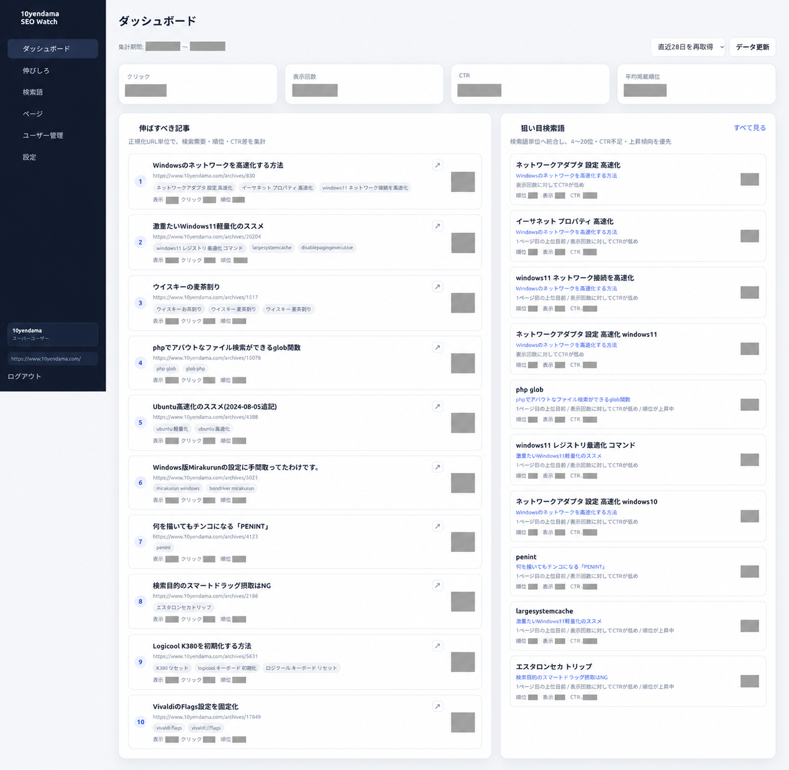

# 10yendama SEO Watch

現在のバージョンはv0.11.0です。v0.11.0では、無効・PHP mail()・SMTPを選べる共通メール配送、SMTP設定の暗号化保存、接続テスト、管理者メールの後付けを追加しました。

メール設定は[メール配送ガイド](docs/MAIL.md)と[SMTP設定](docs/SMTP.md)を参照してください。



Google Search Consoleの実検索データを蓄積し、**伸ばすべき記事・狙い目検索語・改善候補**を提示するセルフホスト型SEO管理ツールです。

ComposerやNode.jsを使わず、PHPとMySQLだけで動作します。Apache系共有サーバーへ直接配置でき、CLI/Cronによる定期取得にも対応しています。

## 主な機能

- Google OAuth 2.0によるSearch Console読み取り専用連携
- 検索語・ページ・国・端末単位の日次パフォーマンス保存
- クリック数、表示回数、CTR、平均掲載順位の集計
- 掲載順位・CTR・表示回数から改善優先度を算出
- 記事単位の「伸ばすべき記事」ランキング
- 検索語ごとの推移、前期間比較、改善アクション
- WordPress REST APIから記事タイトル・更新日時・見出しを取得
- URL正規化と既存データの統合
- 非同期ページングによる高速な一覧表示
- スーパーユーザーと複数の閲覧専用ユーザー
- パスワード再設定、メール確認、閲覧ユーザー招待
- セッション一括無効化、認証レート制限、認証監査ログ
- OAuthトークンはAES-256-GCMで暗号化保存
- ブラウザ手動取得とCLI/Cron取得
- SEO改善タスク、追記専用履歴、記事修正日、修正前後28日の簡易比較
- Web・CLI・Cron共通の同期排他、同期状態、maintenance CLI、DBマイグレーション管理

## v0.10系の改善ワークフロー

1. ダッシュボードや記事詳細で改善候補を確認します。
2. 記事詳細の「タスクへ追加」または改善管理画面から手動作成します。
3. 未対応、対応中、完了、保留、対象外の状態、担当者、メモを管理します。
4. 記事修正日を記録すると、Search ConsoleのPT基準DATEで前後28日を比較できます。

比較結果は修正との因果関係を断定するものではありません。季節変動、検索需要、Googleアップデートなどの影響を含む可能性があります。

## 動作要件

- PHP 8.1以上
- MySQLまたは互換DB
- PHP拡張: `pdo_mysql`, `curl`, `openssl`, `json`, `mbstring`
- HTTPSで公開できるWeb環境
- Google Search Consoleへ登録済みのサイト

ComposerやNode.jsは不要です。

## クイックスタート

1. 空のMySQLデータベースを作成します。
2. リリースZIPをHTTPS公開ディレクトリへ展開します。
3. `https://設置URL/install.php` を開きます。
4. インストーラーの案内に従い、公開URL・DB情報・スーパーユーザー・Google OAuth情報を入力します。
5. インストール完了後、SEO Watchへログインします。
6. Googleと連携し、Search Consoleプロパティを選択します。
7. 初回データを取得します。

### 参考ドキュメント

- [Google OAuth / Search Console API設定](GOOGLE_OAUTH_SETUP.md)
- [インストール手順](docs/INSTALL.md)
- [Cronによる定期取得](docs/CRON.md)
- [heteml向け補足](docs/HETEML.md)
- [アップデート手順](docs/UPGRADING.md)
- [アカウント回復・認証運用](docs/ACCOUNT_RECOVERY.md)
- [改善タスク運用](docs/IMPROVEMENT_WORKFLOW.md)
- [同期ロック](docs/IMPORT_LOCKING.md)
- [メンテナンスCLI](docs/MAINTENANCE.md)
- [DBマイグレーション](docs/MIGRATIONS.md)

## ユーザー権限

| 機能 | スーパーユーザー | 閲覧ユーザー |
|---|:---:|:---:|
| ダッシュボード・分析画面 | ✓ | ✓ |
| 記事詳細・改善提案 | ✓ | ✓ |
| 改善タスク閲覧 | ✓ | ✓ |
| 改善タスク作成・更新 | ✓ | — |
| Google OAuth・プロパティ設定 | ✓ | — |
| データ取り込み・URL正規化 | ✓ | — |
| 閲覧ユーザー作成・削除 | ✓ | — |
| 自分のメール・パスワード変更 | ✓ | ✓ |
| アカウント回復支援・監査ログ | ✓ | — |

閲覧ユーザーはメニューが非表示になるだけでなく、直接URLへアクセスした場合もサーバー側で403になります。

## CLI

```bash
# 動作環境とDB接続を確認
php bin/doctor.php

# 直近3日分を取得
php bin/import.php --days=3

# 期間を指定して取得
php bin/import.php --start=2026-07-01 --end=2026-07-21

# 既存URLを再正規化
php bin/normalize.php

# 緊急パスワードリセット（対話TTY必須）
php bin/reset-password.php --user=admin

# 期限切れ認証データと180日超の監査ログを整理
php bin/purge-auth-data.php

# v0.10系の運用データを安全に確認・整理（既定はdry-run）
php bin/maintenance.php --dry-run
php bin/maintenance.php --execute --target=import-runs
```

`bin/*.php` のshebangは汎用の `#!/usr/bin/env php` です。共有サーバー固有のPHPパスはソースへ直接書き込まず、Cronコマンドまたは `PHP_BIN` 環境変数で指定してください。

## ディレクトリ構成

```text
.
├── app/                    アプリケーションコード
├── assets/                 CSS / JavaScript
├── bin/                    CLI・Cron・運用スクリプト
├── config/                 ローカル設定
├── database/               初期スキーマ
├── deploy/                 Webサーバー設定例
├── docs/                   導入・運用ドキュメント
├── views/                  画面テンプレート
├── index.php               管理画面
├── install.php             ブラウザインストーラー
└── oauth-callback.php      Google OAuthコールバック
```

## セキュリティ

- `config/local.php`、OAuthシークレット、DBパスワードはGitへ追加しないでください。
- 公開環境ではHTTPSを必須にしてください。
- Apache以外では、`app/`, `bin/`, `config/`, `database/`, `tests/`, `views/` をWebから拒否してください。
- インストール後は `config/local.php` と `database/schema.sql` がHTTP 403になることを確認してください。

## ライセンス

[MIT License](LICENSE)
